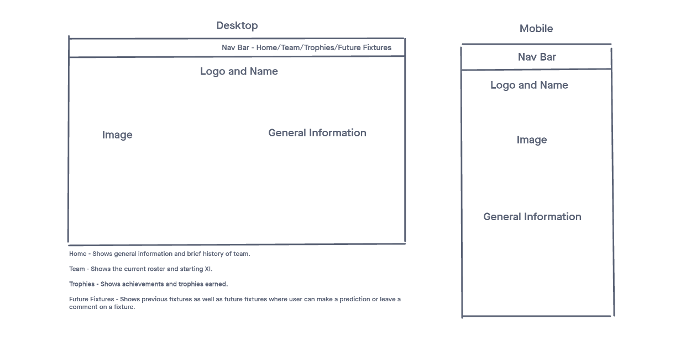
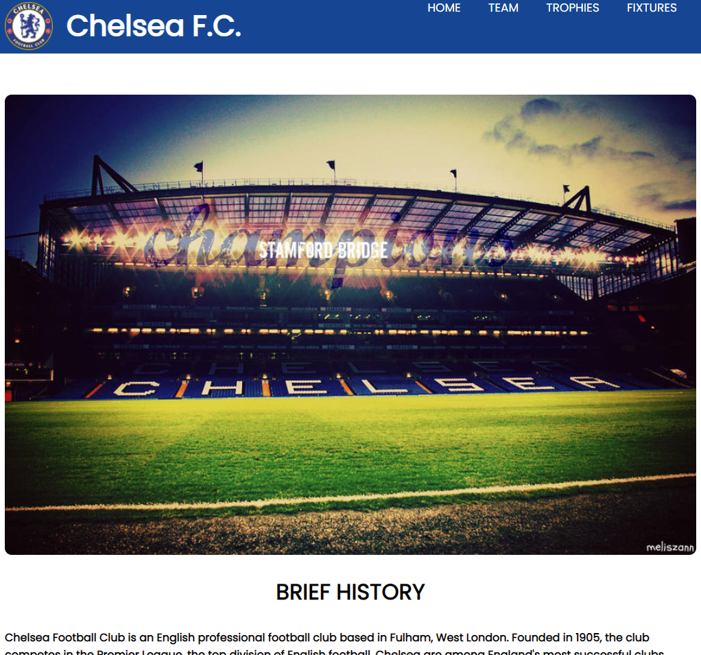
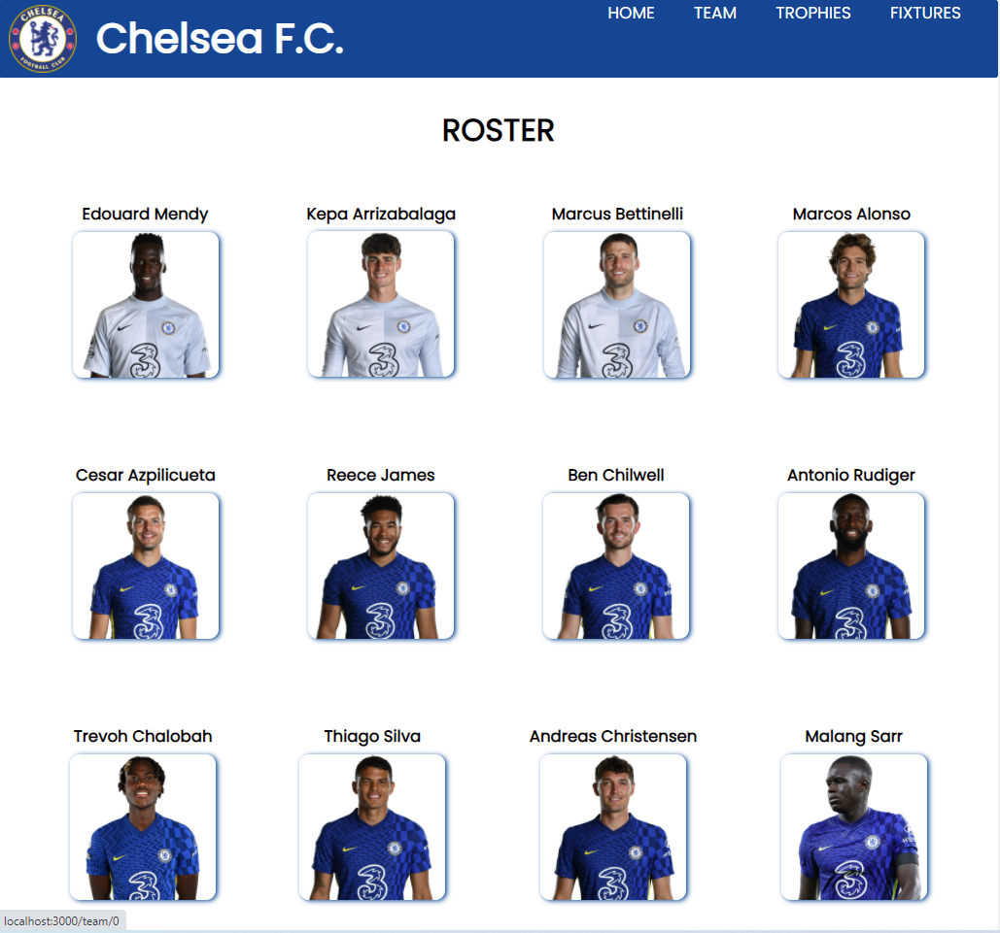
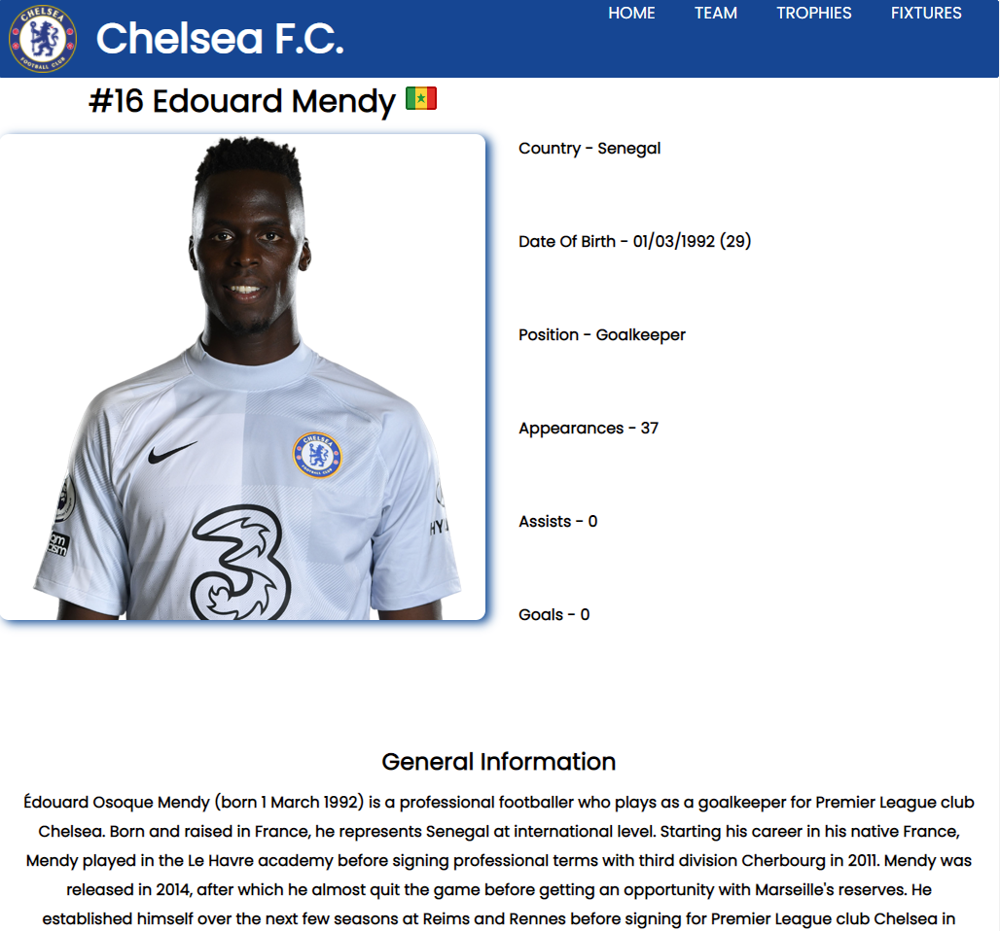
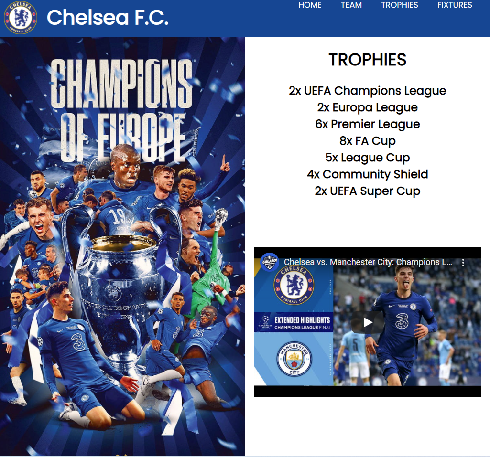
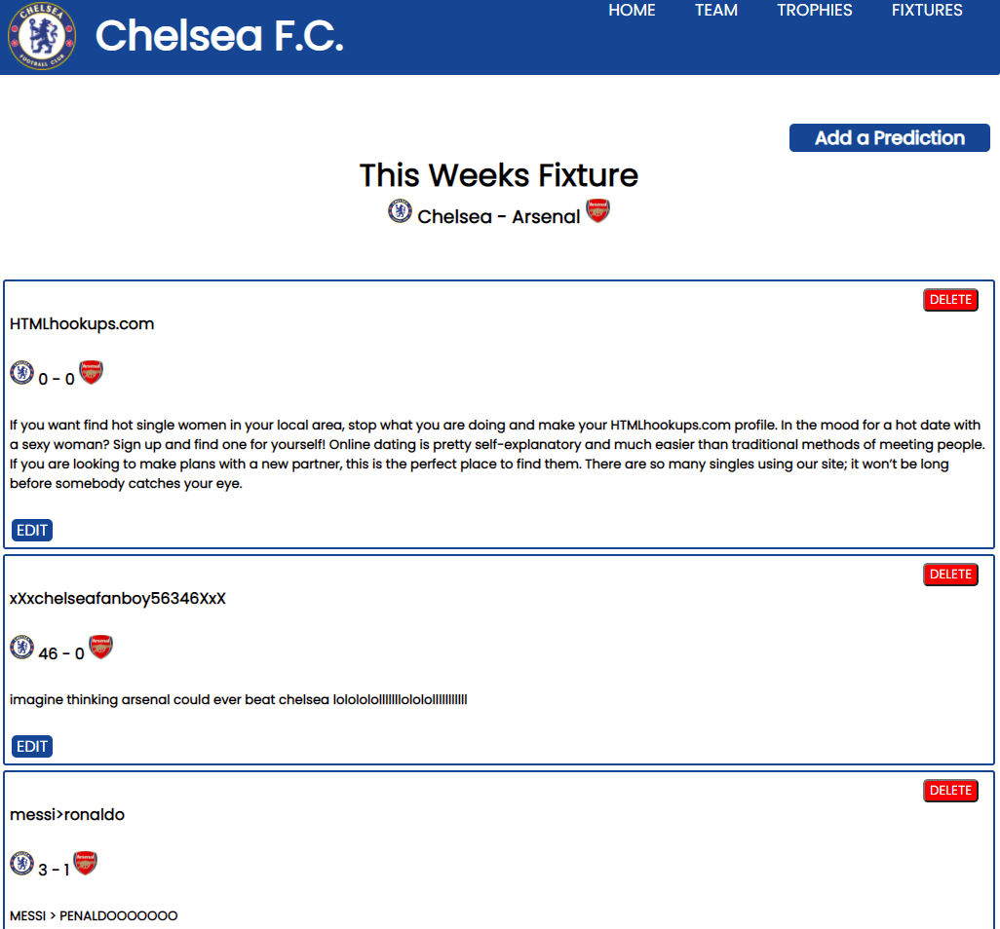

<h1>Boys In Blue</h1>

<h2>Technologies Used</h2>
<ul>
<li>HTML</li>
<li>CSS</li>
<li>JavaScript</li>
<li>Express</li>
<li>EJS</li>
<li>Mongoose</li>
<li>MongoDB</li>
<li>Heroku</li>
</ul>

<h2>Wireframe</h2>

<h2>App Images</h2>

<h2>App Link</h2>

insert link here

<h2>Future Enhancements</h2>
<ul>
<li>User Authentication</li>
<li>Work on mobile side</li>
</ul>
